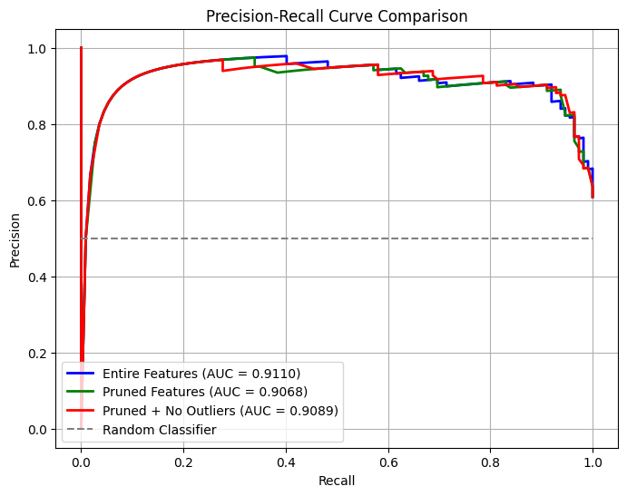
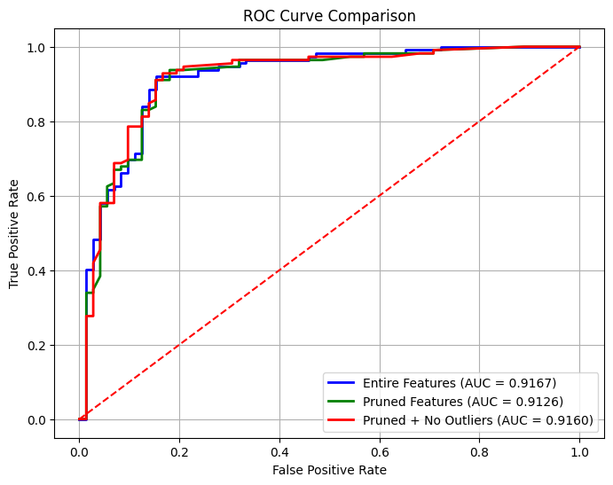

# Heart Disease Prediction Dataset Analysis

## Overview
This repository contains the analysis and findings based on the Heart Failure Prediction Dataset. The dataset, sourced from Kaggle, includes clinical information on 918 participants. It features 11 attributes and a binary label, `HeartDisease`, indicating the presence or absence of heart disease.

The project aimed to:
1. Preprocess and clean the dataset for accurate analysis.
2. Perform exploratory data analysis (EDA) to understand the features and distributions.
3. Apply statistical methods, including hypothesis testing.
4. Build and evaluate logistic regression models for heart disease prediction.

### Main Results
- **Data Cleaning**: Missing values in critical features like cholesterol were imputed using KNN imputation, and original values were preserved for analysis.
- **Feature Engineering**:
  - One-hot encoding and ordinal encoding were applied to categorical variables.
  - Principal Component Analysis (PCA) addressed multicollinearity issues.
- **Statistical Analysis**:
  - ANOVA showed no significant differences in cholesterol levels across chest pain types.
  - Pairwise proportion tests revealed significant associations between binary features and heart disease.
- **Model Development**:
  - Logistic regression models were trained on various feature sets.
  - The best-performing model achieved improved metrics after removing influential outliers.

Key features for heart disease prediction:
- Sex, FastingBS, ExerciseAngina, Oldpeak, ST_Slope, ChestPainType, MissingCholesterolNum.

**Performance Metrics**:
- High accuracy across all models.
- Receiver Operating Characteristic (ROC) curves showed superior threshold performance for the pruned model.

#### Model Performance Comparison

|                         | Accuracy | Precision | Recall |
|-------------------------|----------|-----------|--------|
| Entire Features         | 0.8696   | 0.9000    | 0.8839 |
| Pruned Features         | 0.8696   | 0.9000    | 0.8839 |
| Pruned + No Outliers    | 0.8587   | 0.8981    | 0.8661 |

<div style="display: flex; gap: 20px; justify-content: center;">
  <div style="text-align: center;">
    
    <p>Precision-Recall Curve</p>
  </div>
  <div style="text-align: center;">
    
    <p>ROC Curve</p>
  </div>
</div>

### Binary Feature Statistical Tests

The following table summarizes results from pairwise proportion z-tests. Significant differences in proportions between classes (based on `HeartDisease`) are reported, including confidence intervals and effect size estimates.

| Group                   | z-stat   | p-value        | Reject H₀ | Estimator | 95% CI Lower | 95% CI Upper | p̂₀     | p̂₁     |
|------------------------|----------|----------------|-----------|-----------|--------------|--------------|---------|---------|
| Sex                    | 9.24     | 2.47e-20       | ✅         | 0.372     | 0.301        | 0.443        | 0.631   | 0.259   |
| FastingBS              | -8.12    | 4.84e-16       | ✅         | -0.315    | -0.381       | -0.249       | 0.479   | 0.794   |
| ExerciseAngina         | -15.00   | 6.87e-51       | ✅         | -0.502    | -0.556       | -0.448       | 0.350   | 0.852   |
| ChestPainType_ATA      | 12.16    | 4.85e-34       | ✅         | 0.510     | 0.449        | 0.572        | 0.649   | 0.139   |
| ChestPainType_NAP      | 6.52     | 7.03e-11       | ✅         | 0.258     | 0.183        | 0.333        | 0.610   | 0.351   |
| ChestPainType_TA       | 1.65     | 9.83e-02       | ❌         | 0.124     | -0.023       | 0.271        | 0.559   | 0.435   |
| RestingECG_LVH         | -0.34    | 7.35e-01       | ❌         | -0.014    | -0.093       | 0.066        | 0.550   | 0.564   |
| RestingECG_ST          | -3.12    | 1.80e-03       | ✅         | -0.130    | -0.208       | -0.051       | 0.528   | 0.657   |
| MissingCholesterolNum  | -9.63    | 6.14e-22       | ✅         | -0.406    | -0.466       | -0.346       | 0.477   | 0.883   |


## Getting Started

### Prerequisites
Before you begin, ensure that you have the following installed on your system:
- Python (version 3.7 or higher is recommended). We suggest using [Anaconda](https://www.anaconda.com/) for easier environment and package management.
- Basic knowledge of working with Python virtual environments.

### Installation
Follow these steps to set up the repository for analysis:

1. **Clone the Repository**:
   Open a terminal and run:
   ```bash
   git clone https://github.com/rdgbrian/heart-data-analysis.git
   cd heart-data-analysis
   ```

2. **Create a Python Environment**:
   If you are using Anaconda, create and activate a virtual environment:
   ```bash
   conda create --name <env_name> python=3.9
   conda activate <env_name>
   ```

   Alternatively, using `venv`:
   ```bash
   python -m venv <env_name>
   source <env_name>/bin/activate   # On MacOS/Linux
   <env_name>\Scripts\activate      # On Windows
   ```

3. **Install Dependencies**:
   Use the `requirements.txt` file to install the necessary packages:
   ```bash
   pip install -r requirements.txt
   ```

4. **Verify the Setup**:
   To ensure all dependencies are installed correctly, you can test the installation by running:
   ```bash
   python -m pip check
   ```

Now you’re ready to begin analysis with the repository!


### Usage

To explore and clean the dataset, use the Jupyter notebook:

```bash
clean_data_exploratory.ipynb
```
This notebook performs data preprocessing, exploratory data analysis (EDA), and statistical testing.

```bash
modeling.py
```
This script handles model training, evaluation, and saves performance plots such as the ROC and Precision-Recall curves.

## Dataset
The dataset is available [here](https://www.kaggle.com/datasets/fedesoriano/heart-failure-prediction/data).

### Features
| Feature         | Description                                      |
|-----------------|--------------------------------------------------|
| Age             | Age of the patient [years]                      |
| Sex             | Gender of the patient [M: Male, F: Female]      |
| ChestPainType   | Chest pain type [TA, ATA, NAP, ASY]             |
| RestingBP       | Resting blood pressure [mm Hg]                  |
| Cholesterol     | Serum cholesterol [mg/dl]                       |
| FastingBS       | Fasting blood sugar [1: > 120 mg/dl, 0: ≤ 120] |
| RestingECG      | Resting ECG results [Normal, ST, LVH]           |
| MaxHR           | Maximum heart rate achieved                     |
| ExerciseAngina  | Exercise-induced angina [Y: Yes, N: No]         |
| Oldpeak         | ST depression induced by exercise               |
| ST\_Slope        | Slope of the peak exercise ST segment [Up, Flat, Down] |

## Contributions
Contributions to improve the code, analysis, or extend the findings are welcome. Please follow standard practices for submitting pull requests.

## Project Structure

```plaintext
heart-data-analysis/
├── .gitignore                    # Specifies intentionally untracked files to ignore
├── clean_data_exploratory.ipynb # Jupyter notebook for initial data exploration
├── figures.zip                  # Compressed archive of all generated figures
├── modeling.py                  # Main script for training and evaluating ML models
├── model_utils.py               # Helper functions for modeling workflow
├── readme.md                    # Project description, usage, and documentation
├── requirements.txt             # Python package dependencies
├── results.txt                  # Output metrics or experiment results
├── STA_Presentation.pptx       # Project summary presentation (PowerPoint)
│
├── data/                        # Source and processed datasets
│   ├── clean_heart.csv
│   ├── clean_heart_pca.csv
│   ├── heart.csv
│   ├── LifetimeDataANOVA.csv
│   └── MultRegData.csv
│
├── figures/                     # Generated plots and visualizations
│   (figures omitted for brevity)
│
└── rcode/                       # R scripts for statistical analysis
    ├── exploratory2.R
    ├── exploritory.R
    └── MultRegAprt2andANOVAPart1.R
```
---

## License
This project is licensed under the MIT License.

